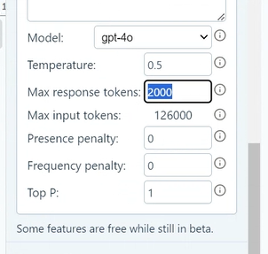
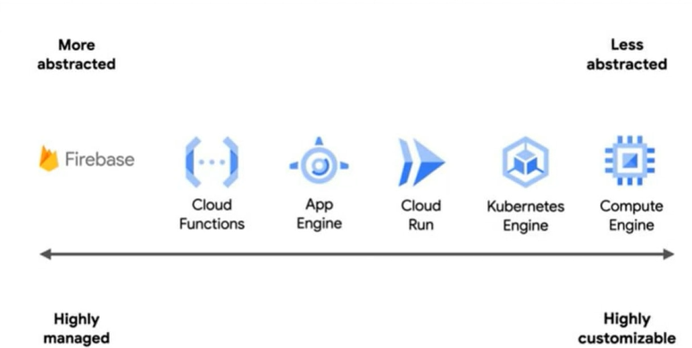

# AI
* Different large language models will provide different answer. Some will provide correct answers, some won't.
### GPT for sheets or word doc.

# GCP

### Why should we use cloud technology?
1. ONLY cost the amount that you use. Don't need to spend extra costs
2. Reliability
3. Reduce latency
4. Law related: Some nations only allow data to be restricted in their territory. Datas can not be spread to other areas.  
### Cloud benefits:
1. Compute
2. Storage
3. Networking Service