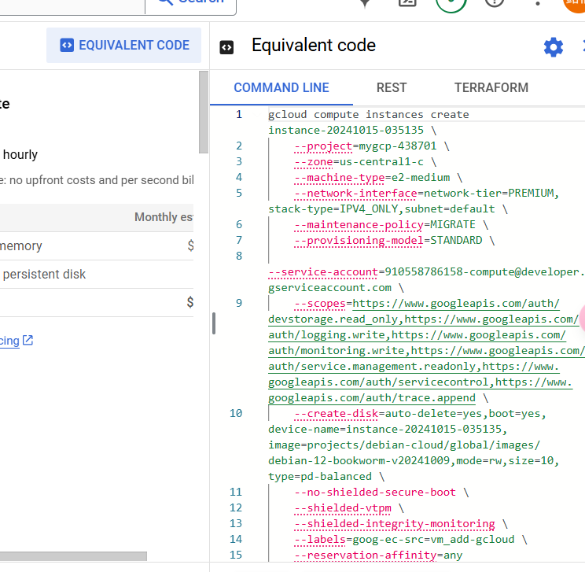
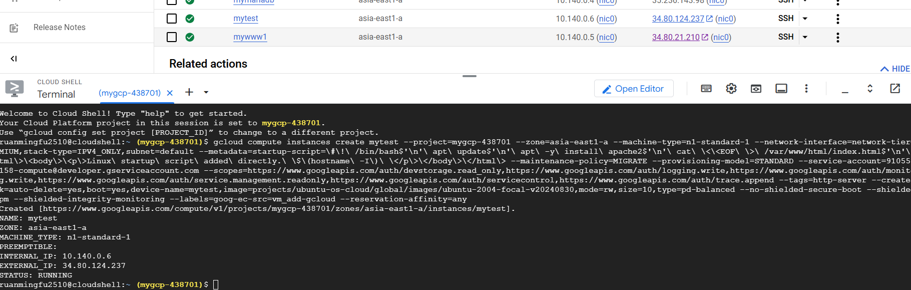

# Live Captions:
```
Help you translate videos aside from Youtube's via captions 
```
```
Google Settings ----> Accessibility -----> Live Captions (Caption Preferences)
```
# GCP:
## Automatically create VM instance using equivalent code:


## How to build database server: 
* Database server runs at port 3306
* Gotta change the server IP from 127.0.0.1 to 0.0.0.0 so that it can accept traffic from all interfaces in the VM.
* The database itself doesn't allow root to login without using 127.0.0.1