# How to change to new GCP account with the same biling account when out of free trials:
https://www.shanyemangfu.com/gcp-300-old-account.html
# VPC network:
## Firewall rule:
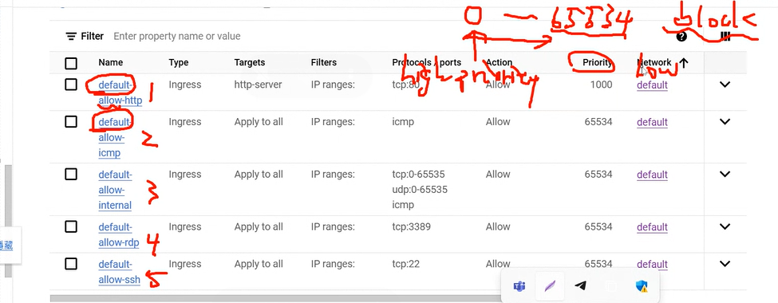
* Priority goes from 0 to 65534 with 0 being the highest priority and 65534 being the lowest of being blocked
## Custom setting for subnet creation:
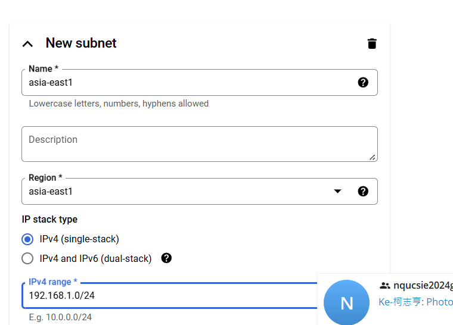
## Create firewall rules manually:
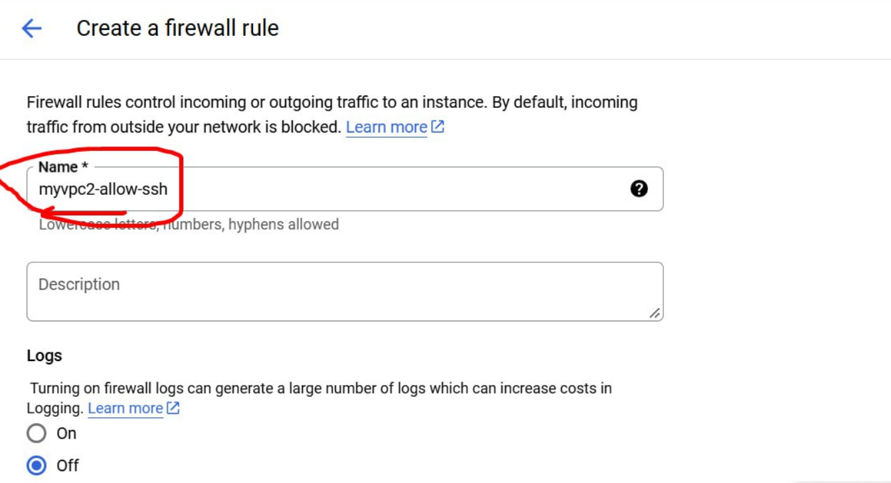
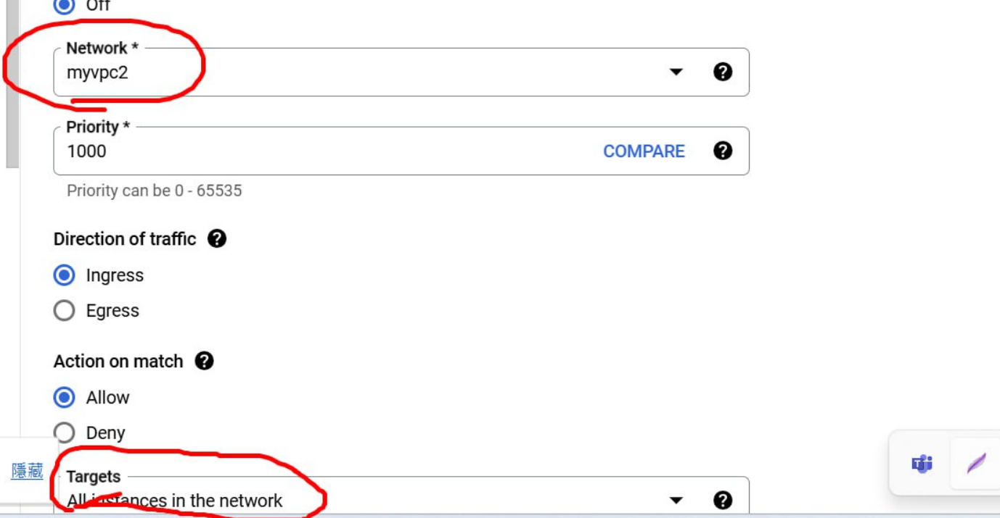
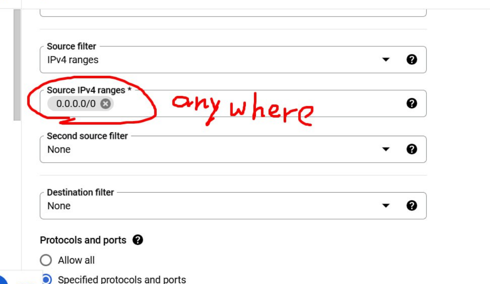
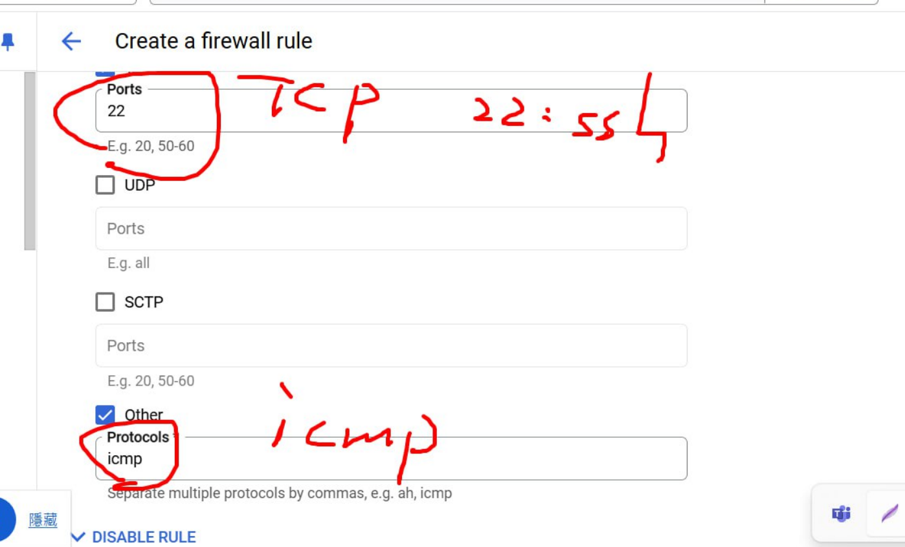
* Successfully created:
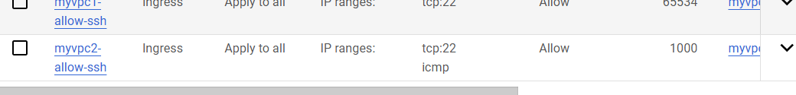
## Bidirectional vpc network peering:
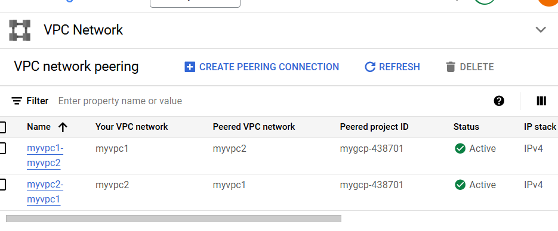
* Ping successfully within the same region:
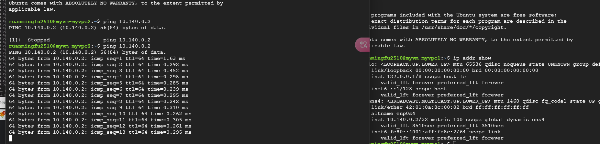
## SSH login:
* First vm
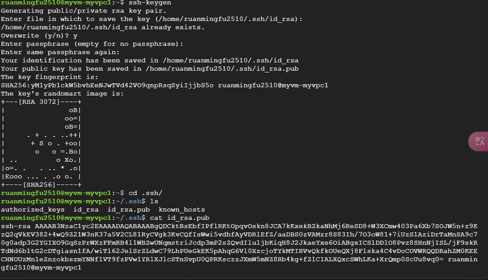
* Second vm
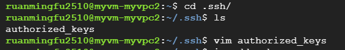

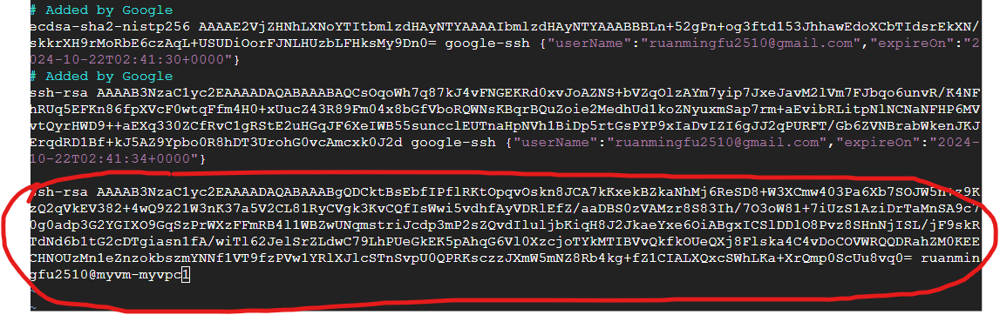
* First vm
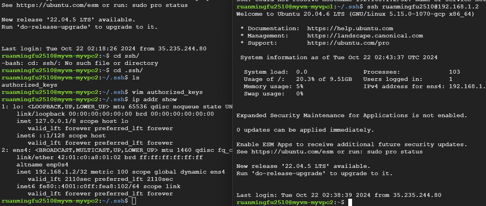
## HTTP server:
* need to install python3 (sudo apt install python3)
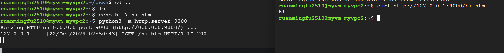