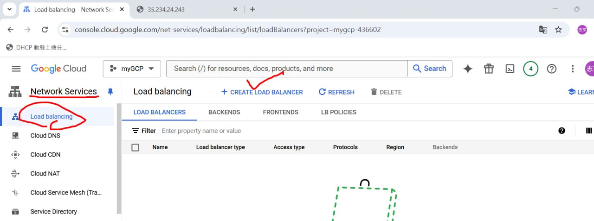
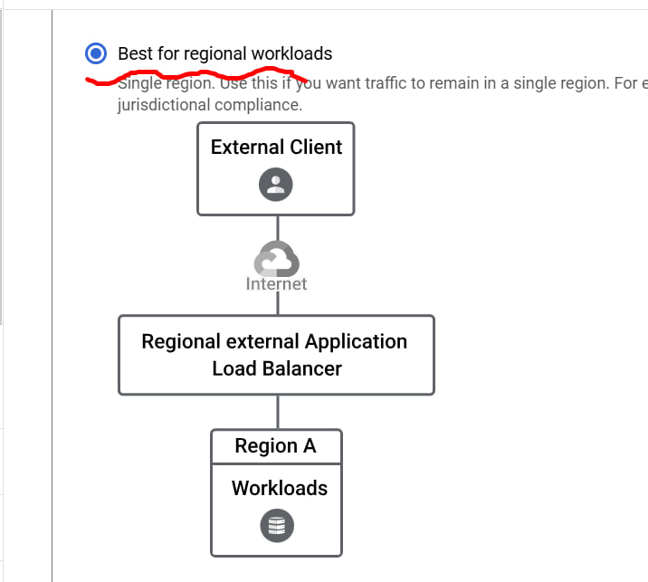
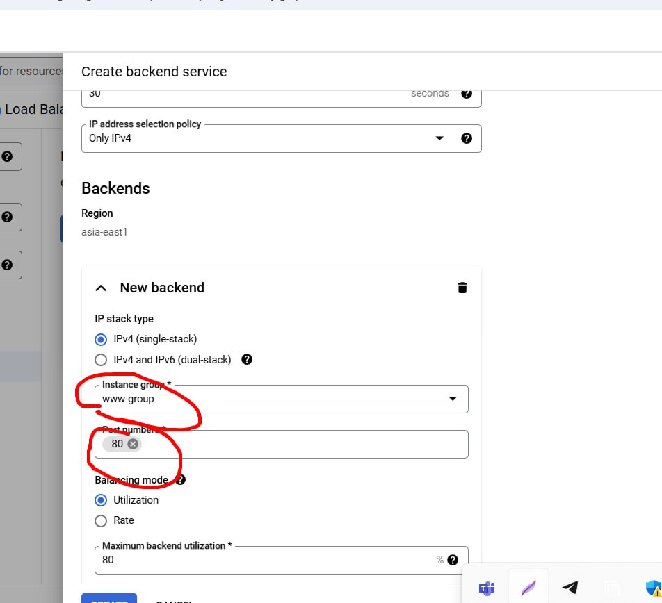

# Search Engine
## [Perplexity](https://www.perplexity.ai/):
```
Give user the direct answer instead of giving various websites like Google
```

** But now Google has the AI system that will highlight the right answer while giving multiple websites.

## [XAnswer](https://www.xanswer.com/):
```
Not only give answers in texts but also organize it in graphs.
```


# Cloud SQL:
```
Provides serverless service
```
1. Enable Cloud SQL API

2. Create SQL instances

3. Use cloud shell install mysql-client
```
ruanmingfu2510@cloudshell:~ (mygcp-438701)$ sudo apt install mysql-client -y
Reading package lists... Done
Building dependency tree... Done
Reading state information... Done
mysql-client is already the newest version (8.0.39-0ubuntu0.24.04.2).
0 upgraded, 0 newly installed, 0 to remove and 2 not upgraded.
```
4. Click Open Shell for the first time

5. And you can connect it for the next time using this command 


```
Gotta change from public address to private address so that only instances from the same region can connect:
```

## Other VM instances in the same region can also connect to the cloud SQL:

# Load Balancer:
## 1. Unmanaged:
Gotta create servers by ourself
* Create 2 vm instances:

(need to be in the same zone, have HTTP traffic, and manage script)
* Create instance group (unmanaged one)

* Create load balancer:





* Frontend:

* Backend:

* Health check:

* DONE:

## What difference does load balancing do:
