# GCP midterm
## Question: 
```
You need to create two vpc networks, i.e. myvpc1 and myvpc2. In myvpc1 (any zone), create two VMs with http server. In myvpc2, create DB (vm or cloud sql). make http servers connect to DB. Also add one load balancer. If a customer connect to LB, LB will dispatch the traffic to the backend http server.
```
## CREATE VPCs:
VPC1: (subnet creation : automatic)
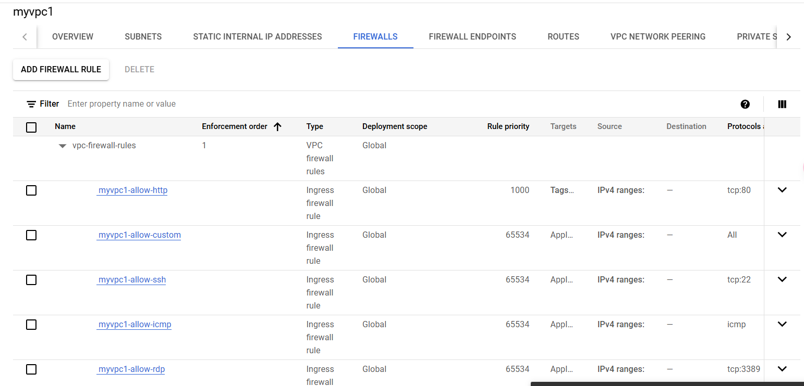
VPC2: 
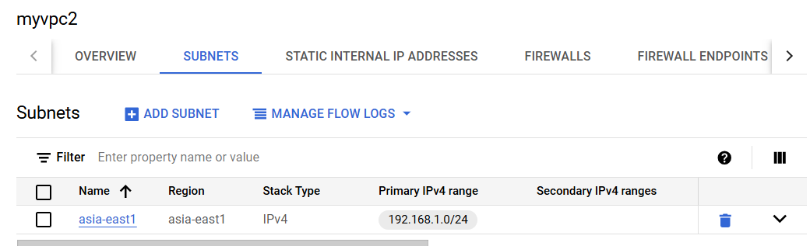
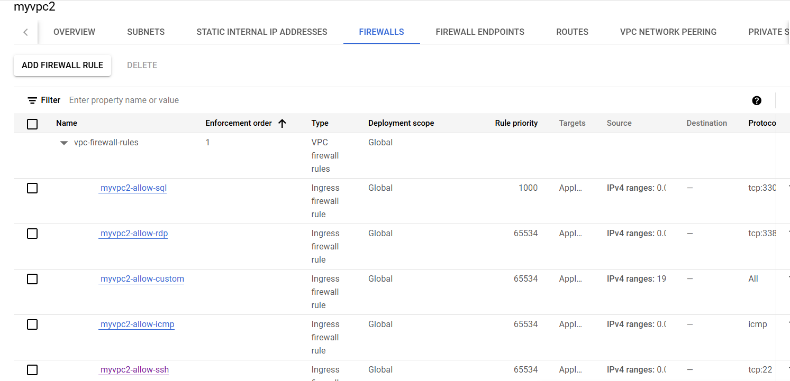
```
*REMEMBER to add firewall policy allowing port 3306.
```
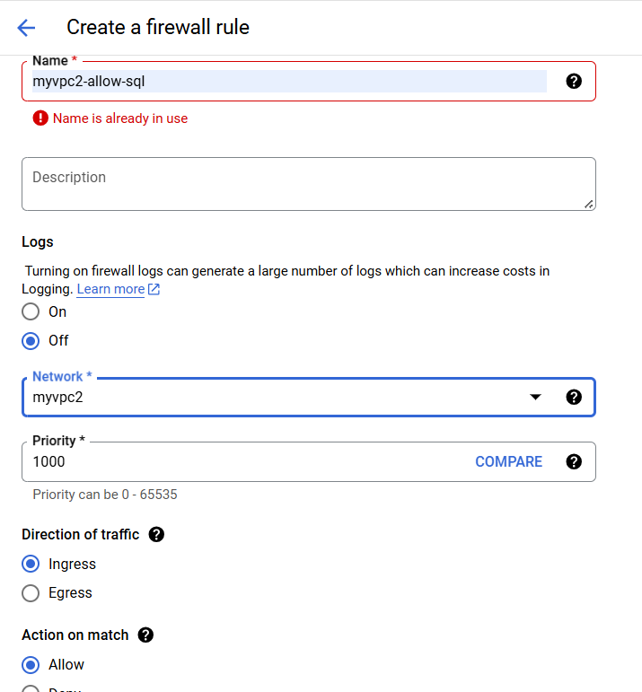
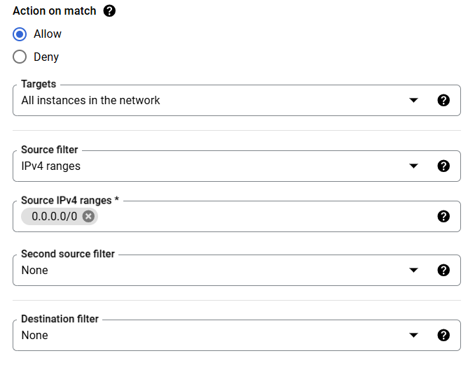
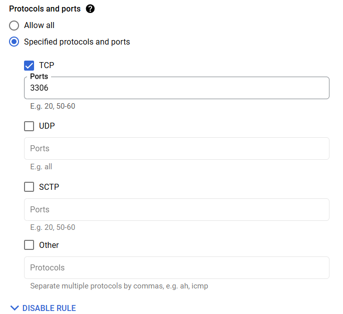
## VPC network peering:
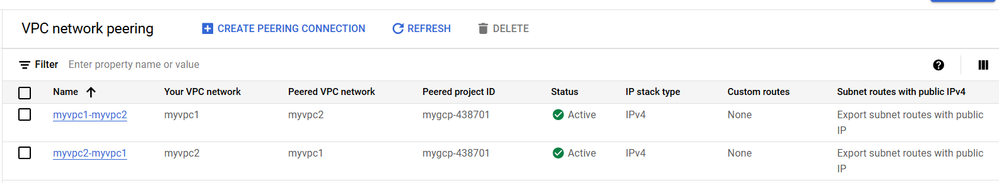
## Create 2 VM instances:
```
REGION: asia-east1(Taiwan)
Operating system: UBUNTU
```
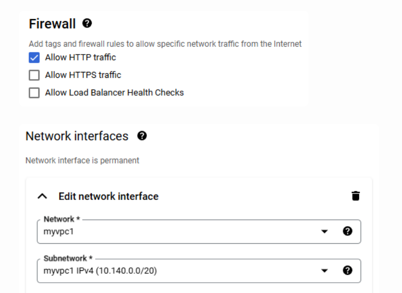
## Create Database: (as VM instance)
```
REGION: asia-east1(Taiwan)
Operating system: UBUNTU (22.04)
Network: myvpc2
```
## Database settings with SSH:
[Follow steps from this link](https://blog.tarswork.com/post/mariadb-install-record)
* IMPORTANT STEPS:
1.
```
sudo vim /etc/mysql/mariadb.conf.d/50-server.cnf
#bind-address = 127.0.0.1
```
2.
```
sudo mysql -u root -p
12345678
```
3.
```
GRANT ALL PRIVILEGES ON *.* TO 'root'@'%' IDENTIFIED BY '12345678' WITH GRANT OPTION;
FLUSH PRIVILEGES;
```
4. 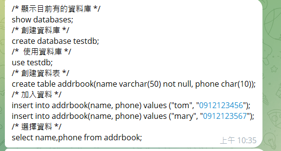

5. 
```
sudo apt install apache2 php libapache2-mod-php php-mysql
```
6. 
```
sudo systemctl restart apache2
```
7. 
```
sudo vim testdb.php
```
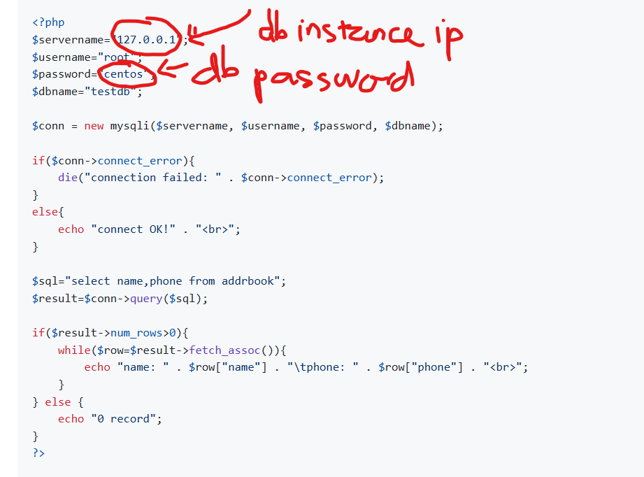
## Create Loadbalancer:
* Create instance group (unmanaged one)
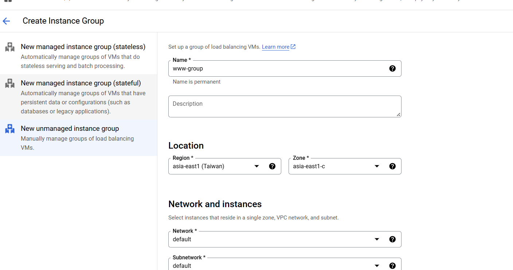
* Create load balancer:
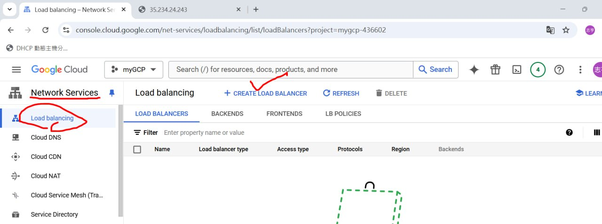
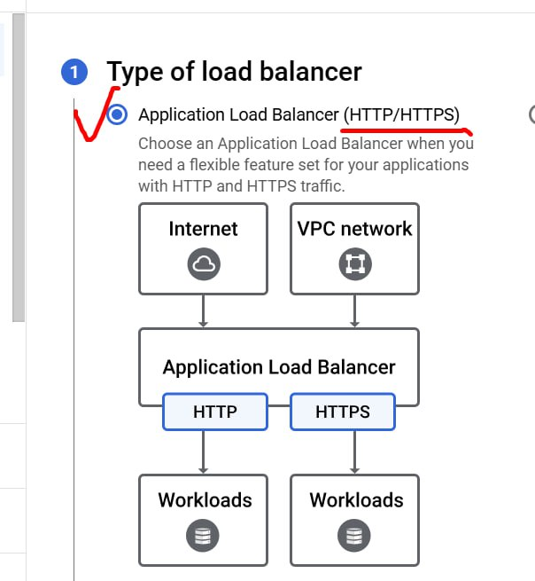

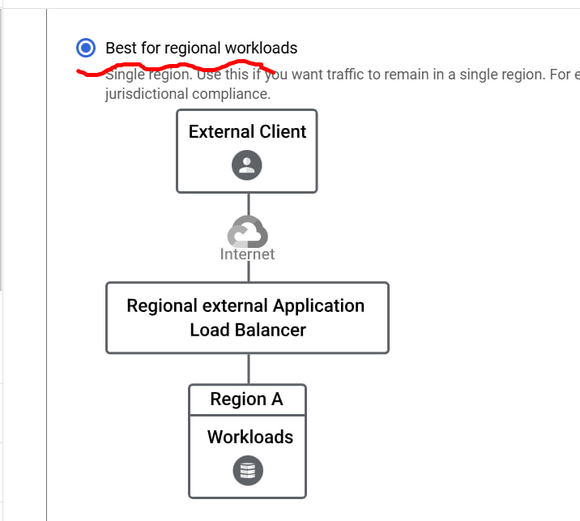
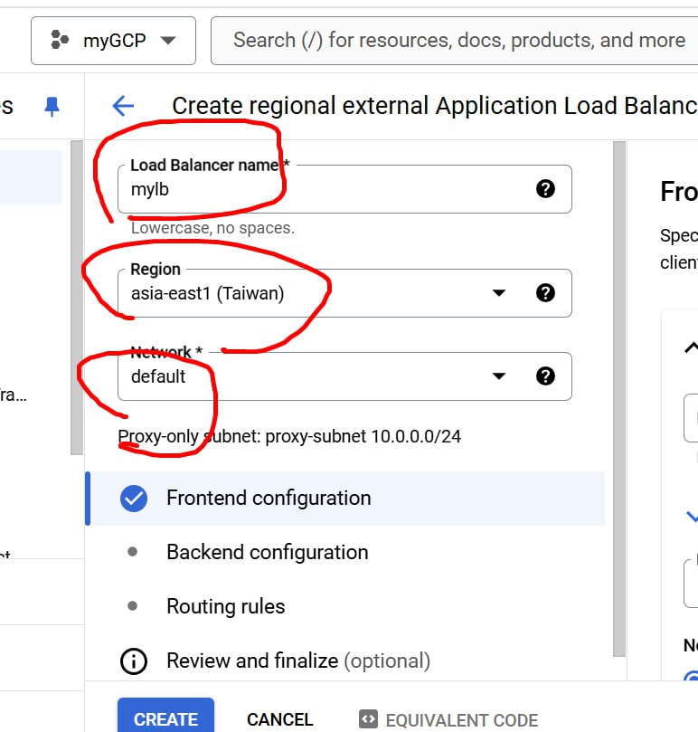
* Frontend:
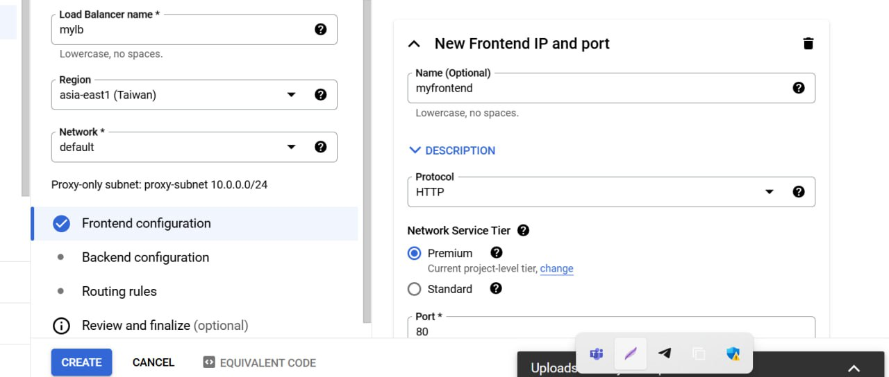
* Backend:
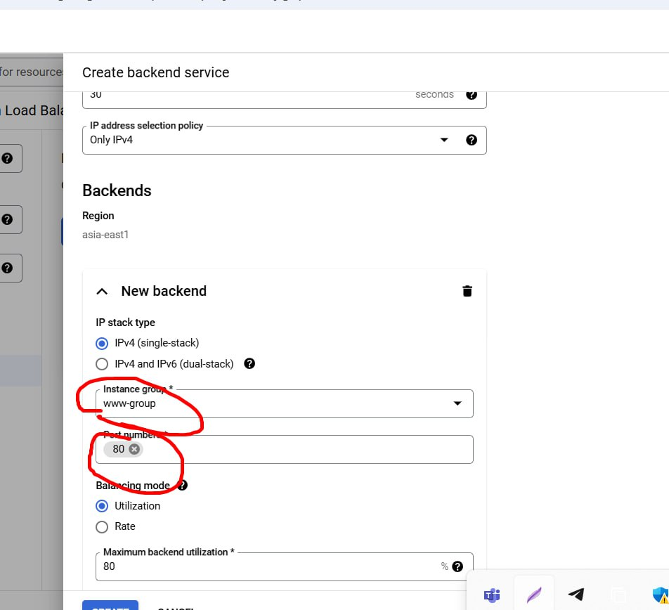
* Health check:
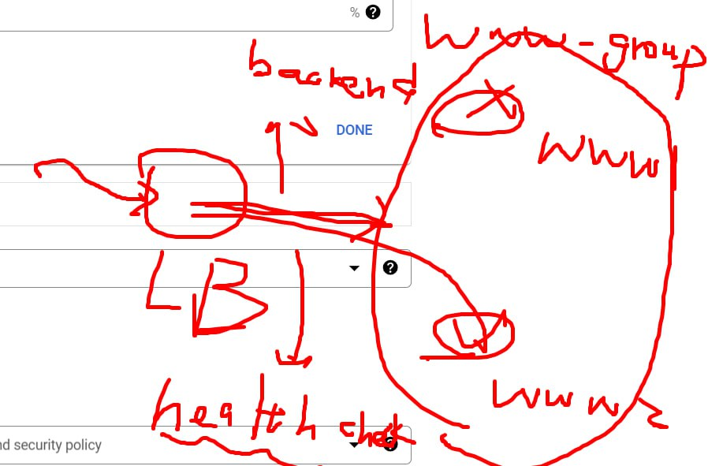

## Find load balancer IP and connect.