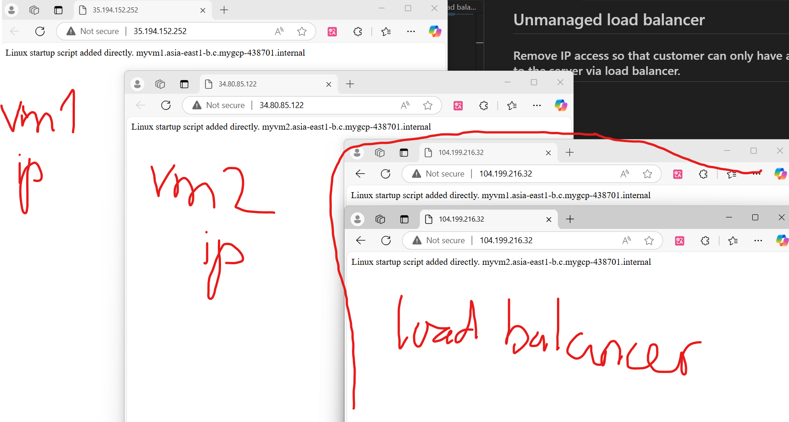
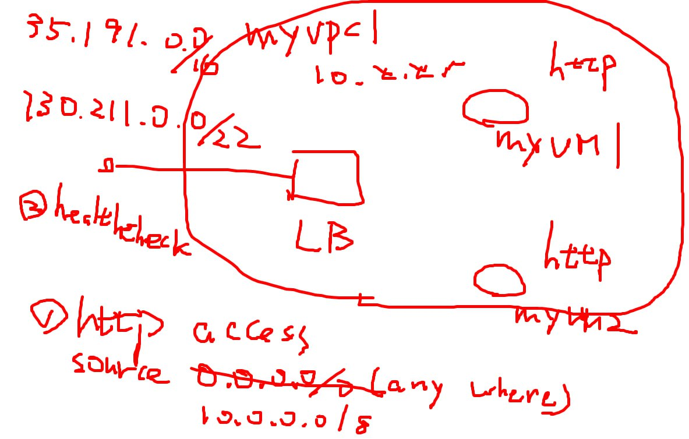
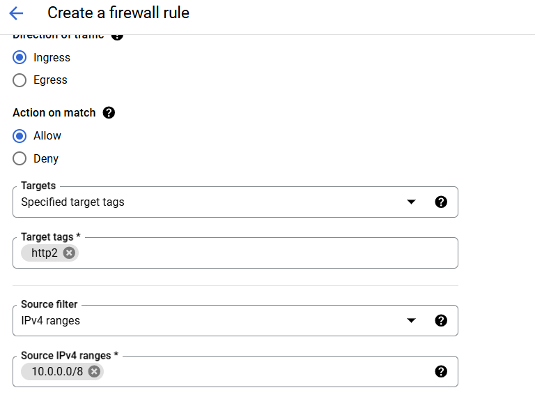
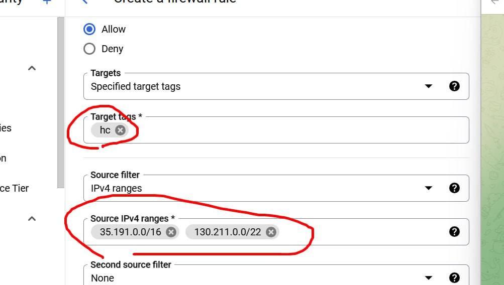
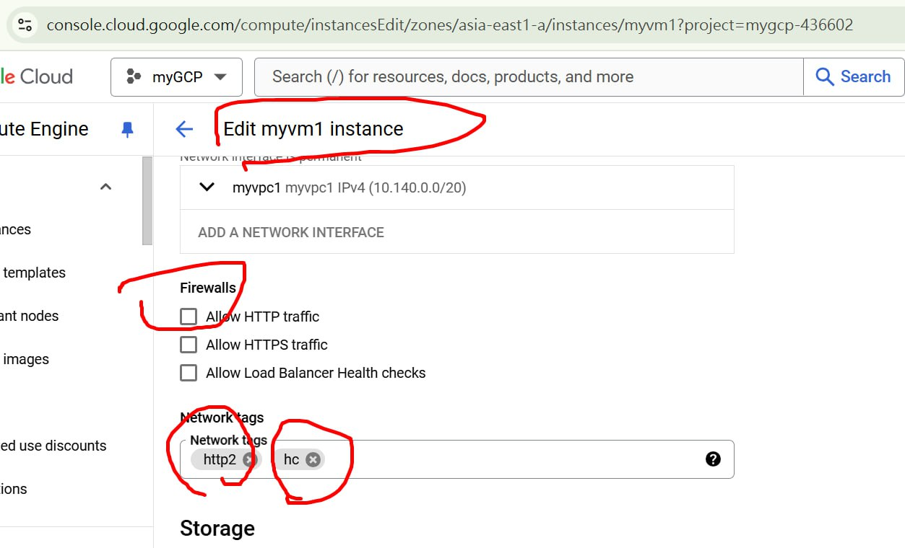
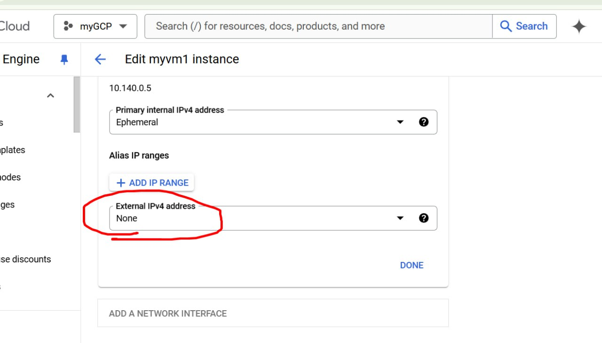
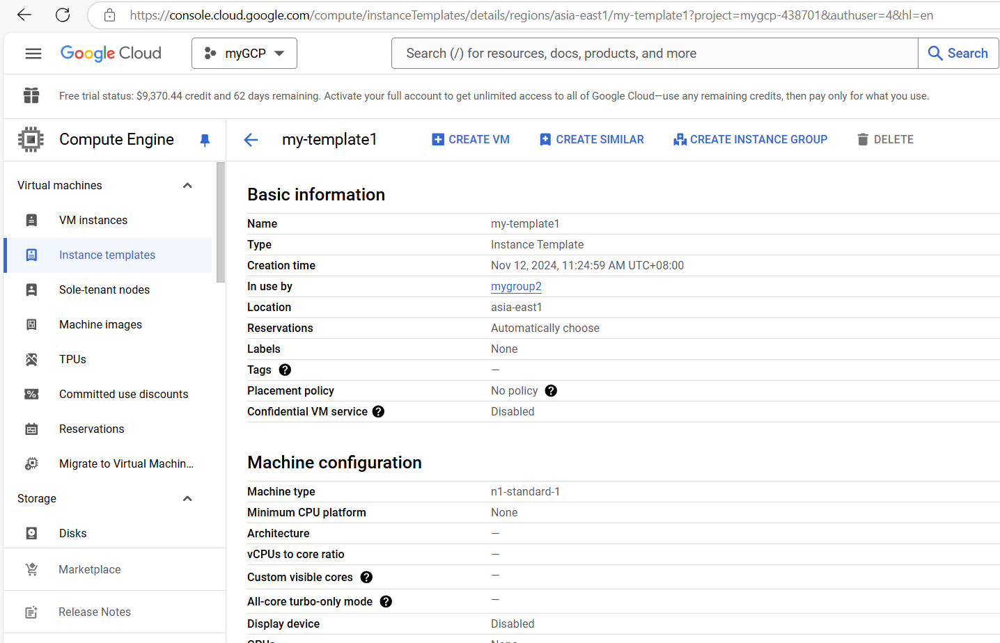
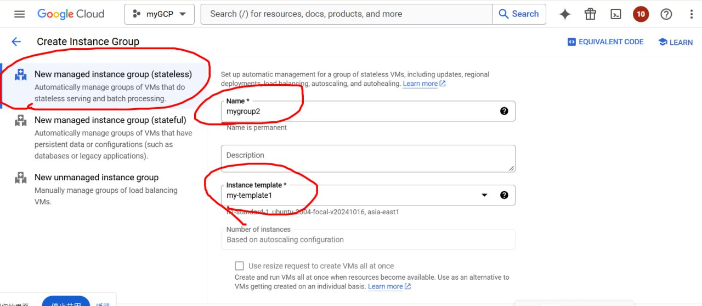
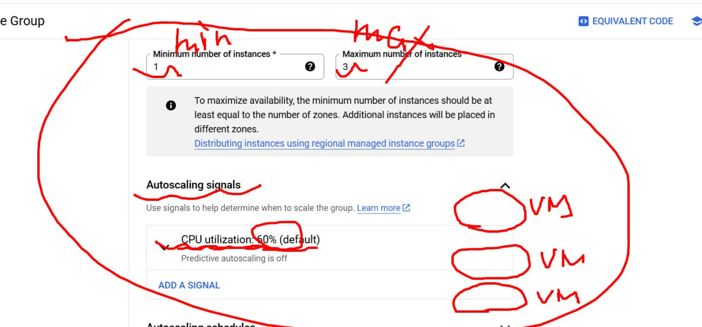
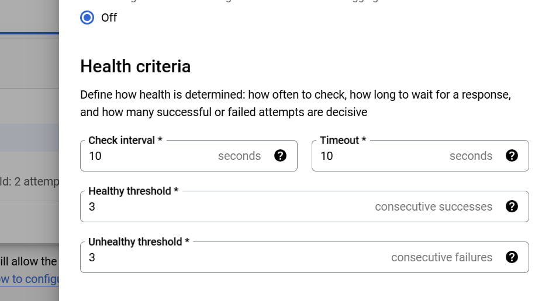

# Unmanaged load balancer
## Remove public IP address so that customer can only have access to the server via load balancer.
### First, create 2 vms in myvpc1 network and add load balancer to them.

### Instructions:

#### Firewall rule:
1. HTTP access

2. Health check

3. Edit VM1, VM2:

# Managed load balancer
## instance-template->instance groups-> load balancer
### INSTANCE TEMPLATE

### INSTANCE GROUP

