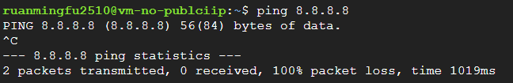
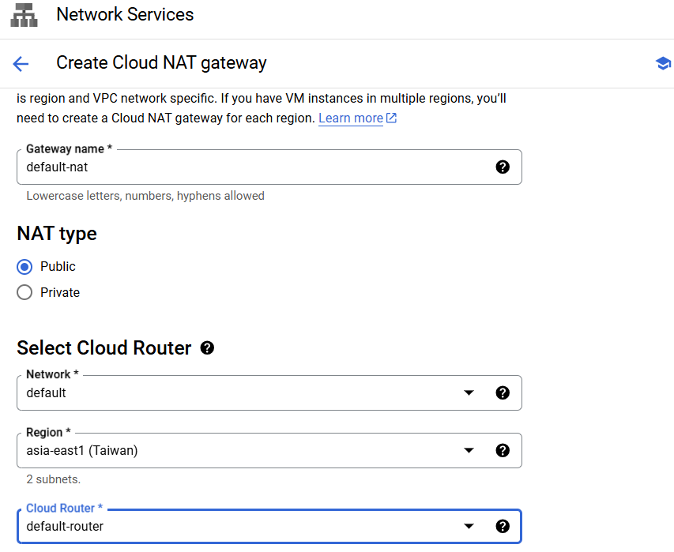
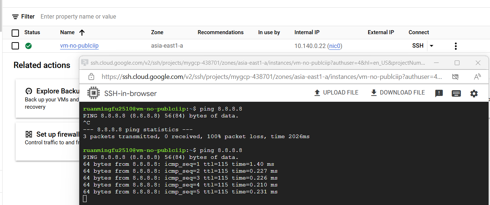
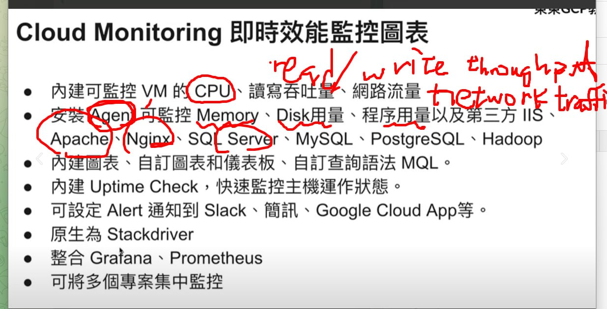
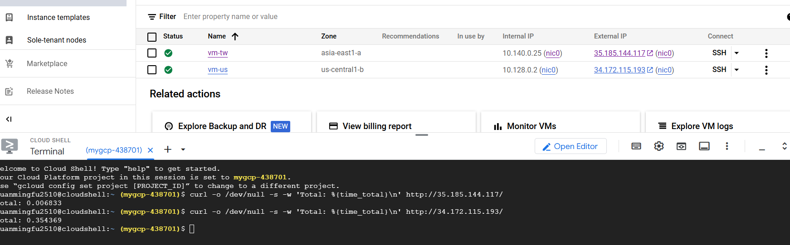
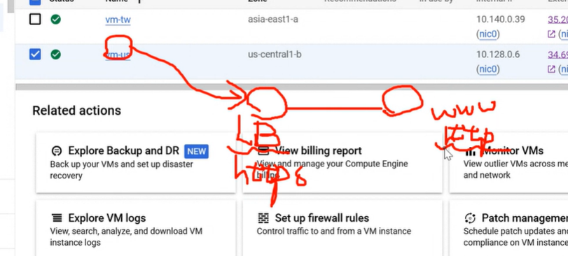
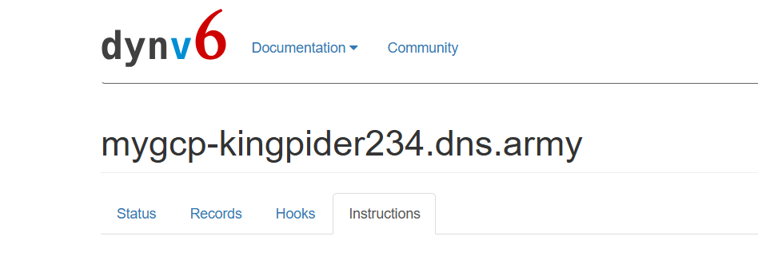

# Problem 1:

* Create a VM with no external IP

* We can't Ping

* Create Cloud NAT

* After:


# Monitoring & Alerting

* Create a Vm with Http traffic and management script:
```
#! /bin/bash
 apt update
 apt -y install apache2
 cat <<EOF > /var/www/html/index.html
 <html><body><p>Linux startup script added directly. $(hostname -I) </p></body></html>
```

* Install Ops Agent

# Curl Taiwan and Us vm instances:


# Problem 2:



# Deploy Cloud CPN