# PROBLEM:
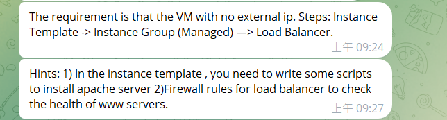
## Step1:
Create VPC network:
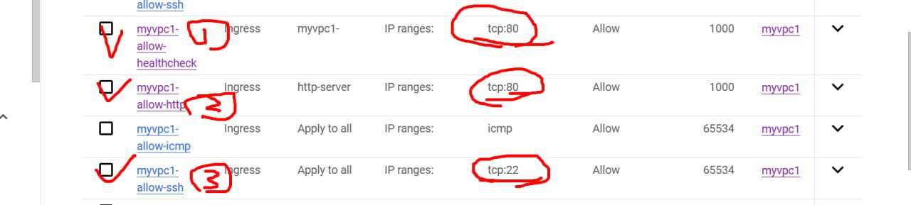
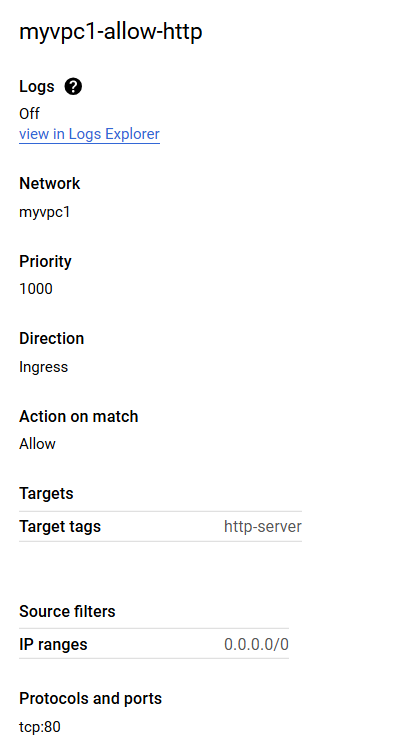
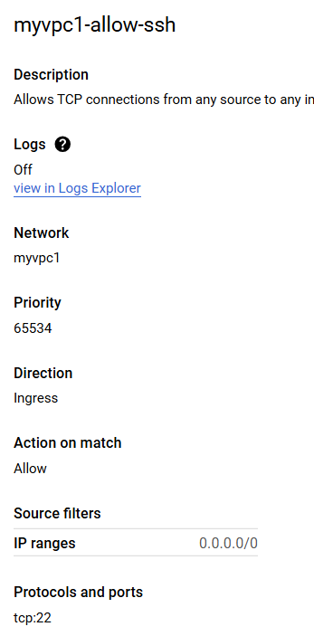
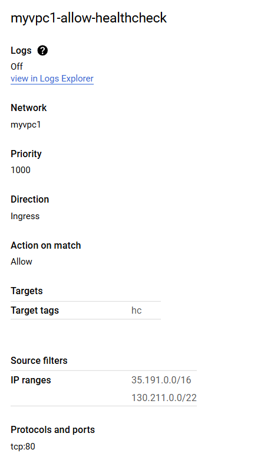
## Step2: Create Cloud NAT
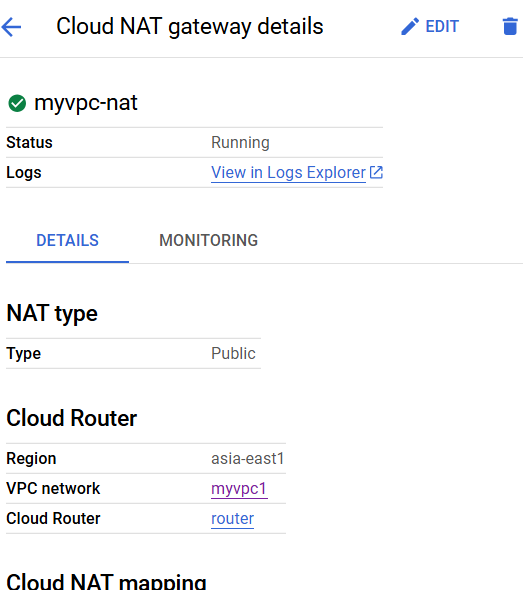
## Step3: Create Instance template
### *VPC1 network
### *No external IP
### *Allow HTTP
### *Script to install Apache
## Step4: Create Instance Group (managed)
## Step5: Create Load Balancer
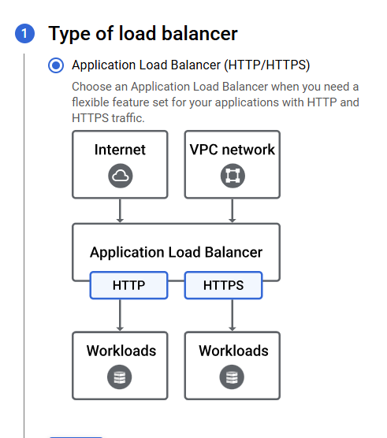
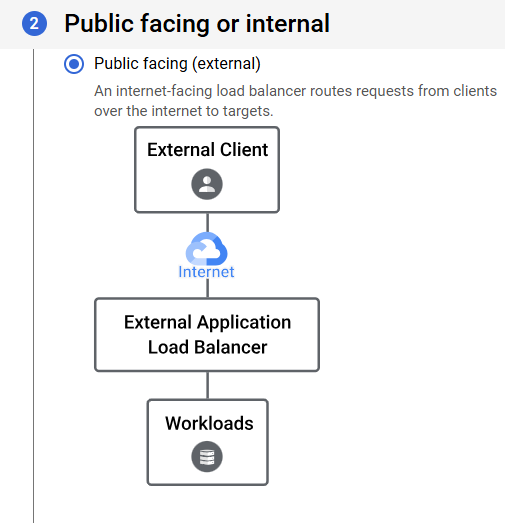
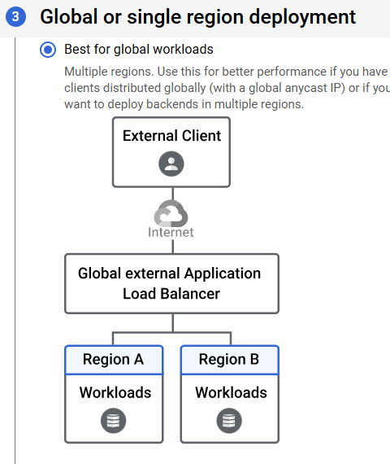
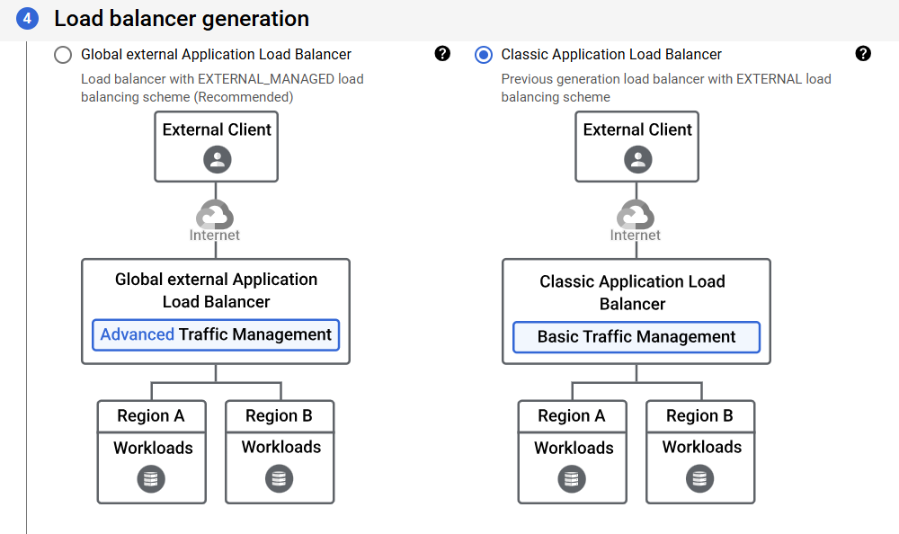
## Final:
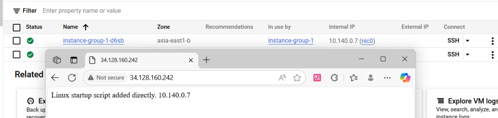
# CLOUD ARMOR:
https://medium.com/@kellenjohn175/how-to-guides-gcp-security-%E4%BB%A5cloud-armor-%E5%BC%B7%E5%8C%96-beyondcorp-%E5%AE%89%E5%85%A8%E6%A8%A1%E5%9E%8B-c277d5e0cb15 
# Advanced Load Balance:
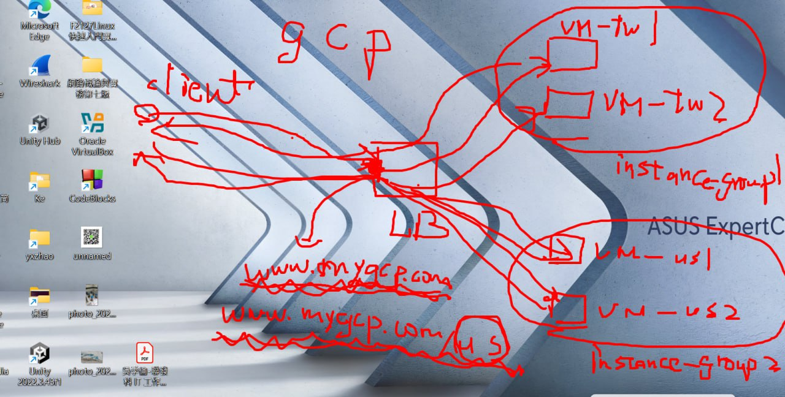
## Step1: Create 4 Vm instances (2 taiwans, 2 us)
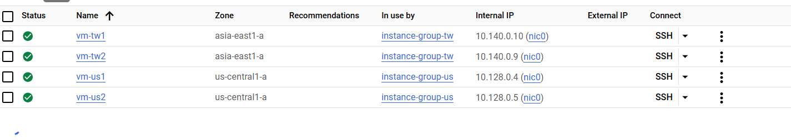
## Step2: Create 2 Instance Groups (1 contains 2 taiwan machines, the other contains 2 us machines)

## Step3: Create Cloud NAT
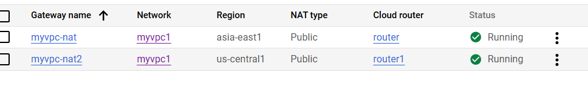
## Step4: Create Load Balancer:
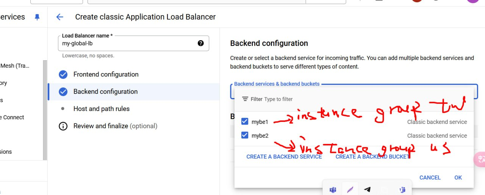
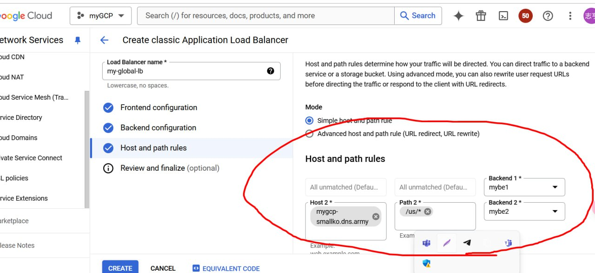
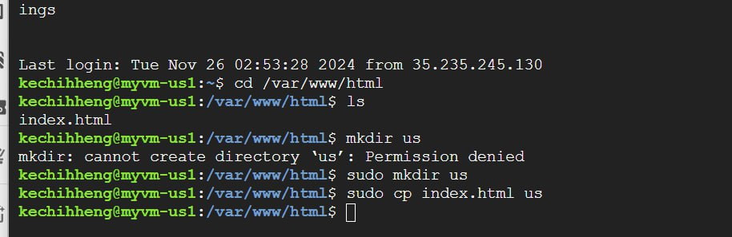
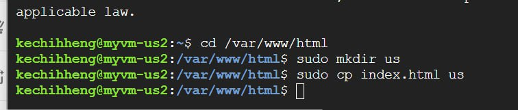
## Step5: 
## Final:
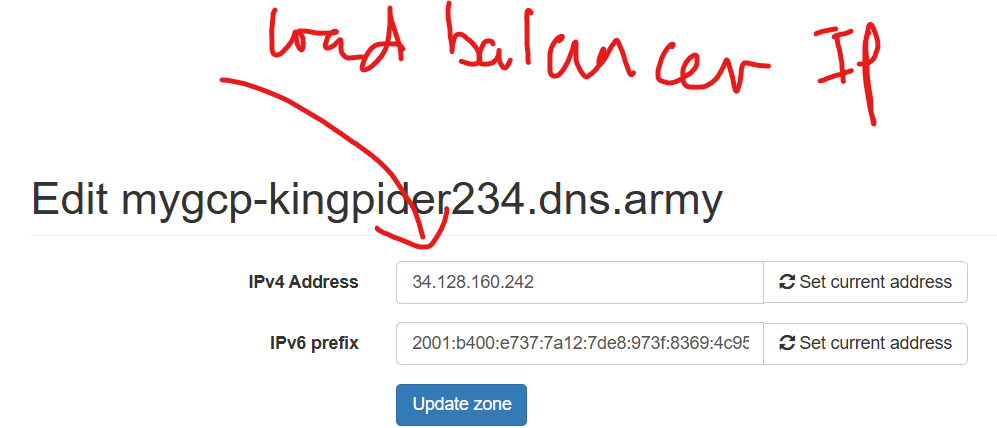
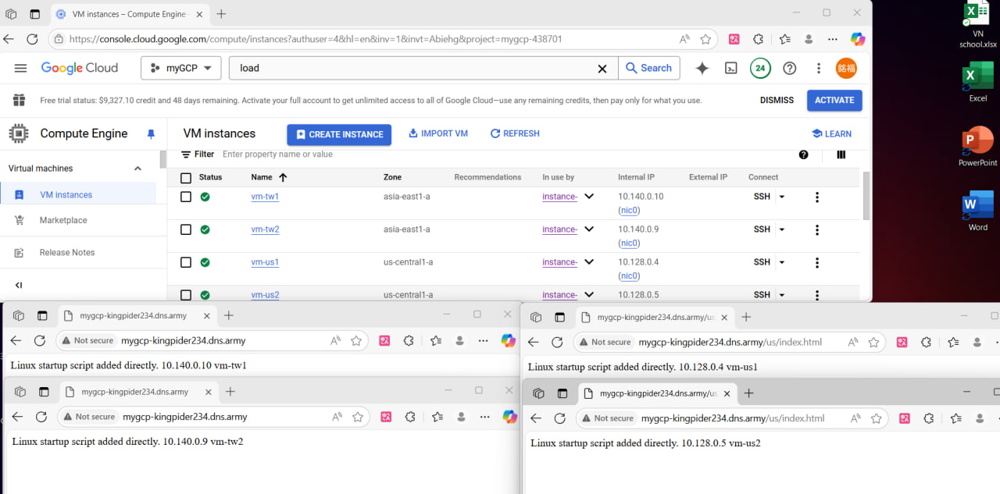

# PROBLEM2:
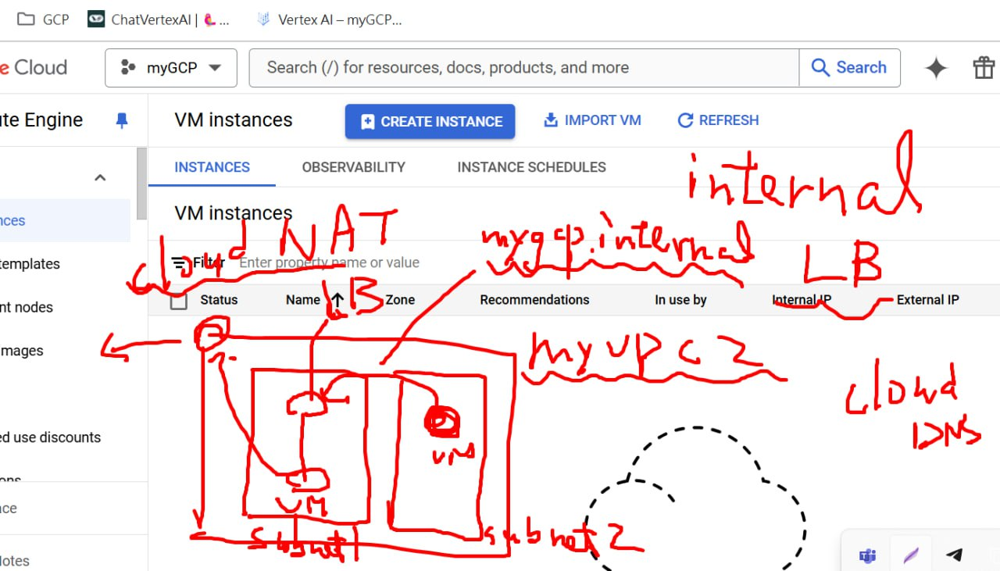

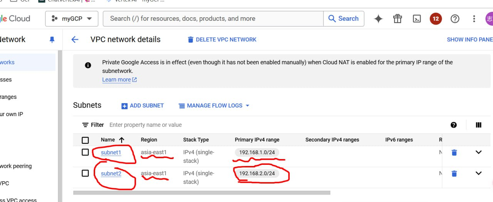

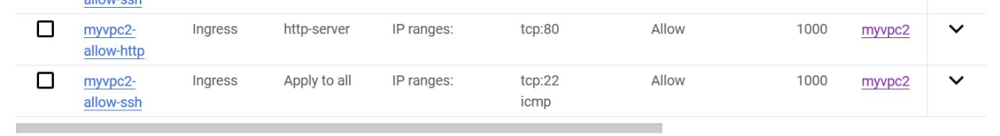

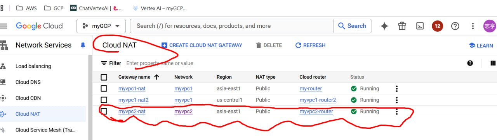

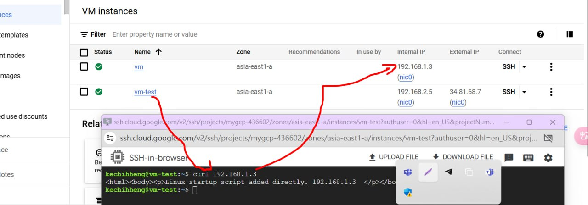