# 1. CLOUD FUNCTION
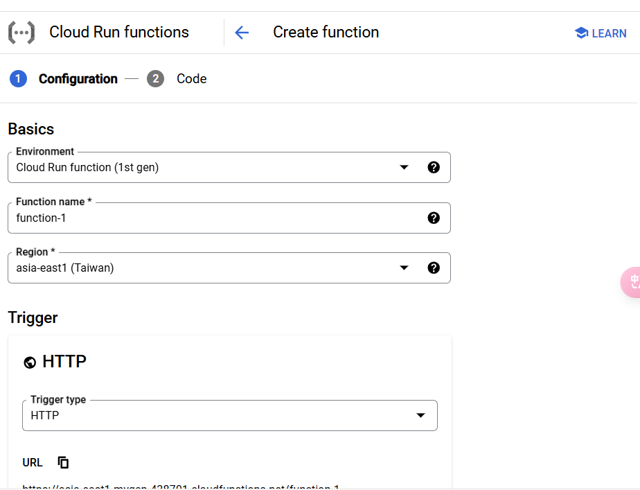
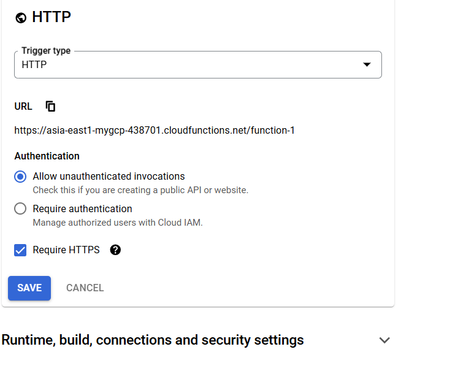
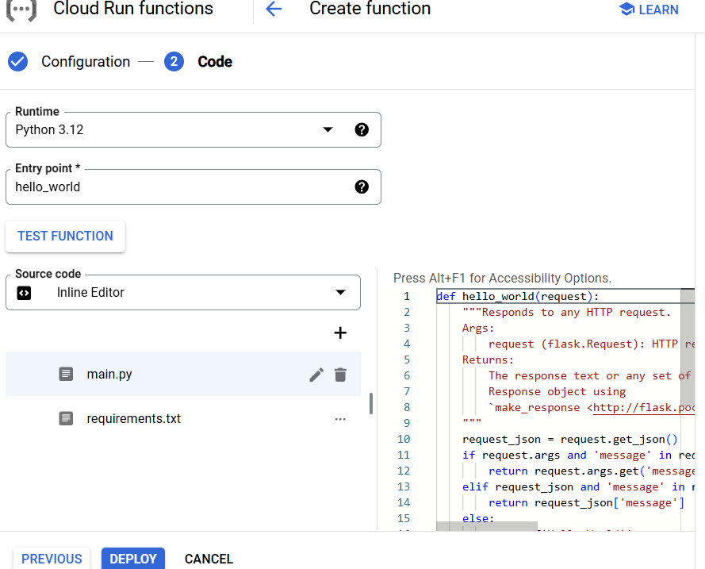

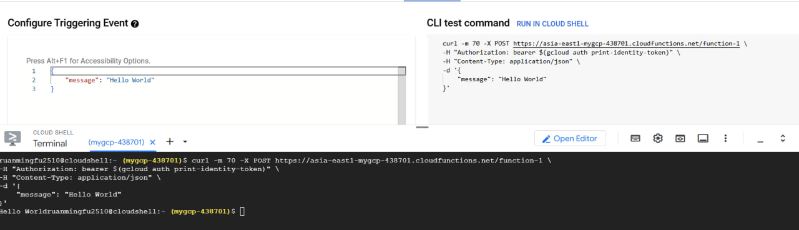

# 2. Move Large Files from GCS bucket using Cloud Function
## If file is larger than 1MB it will automatically be transfered to the other bucket
https://medium.com/google-cloud/move-large-files-from-gcs-bucket-using-cloud-function-232852b10a4c

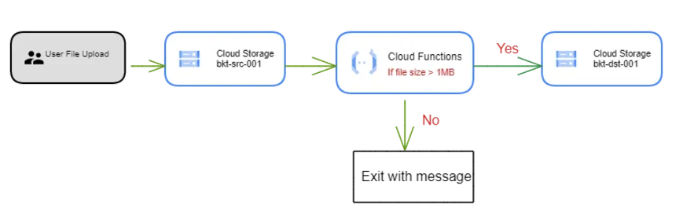

## Create 2 buckets
## Create cloud function
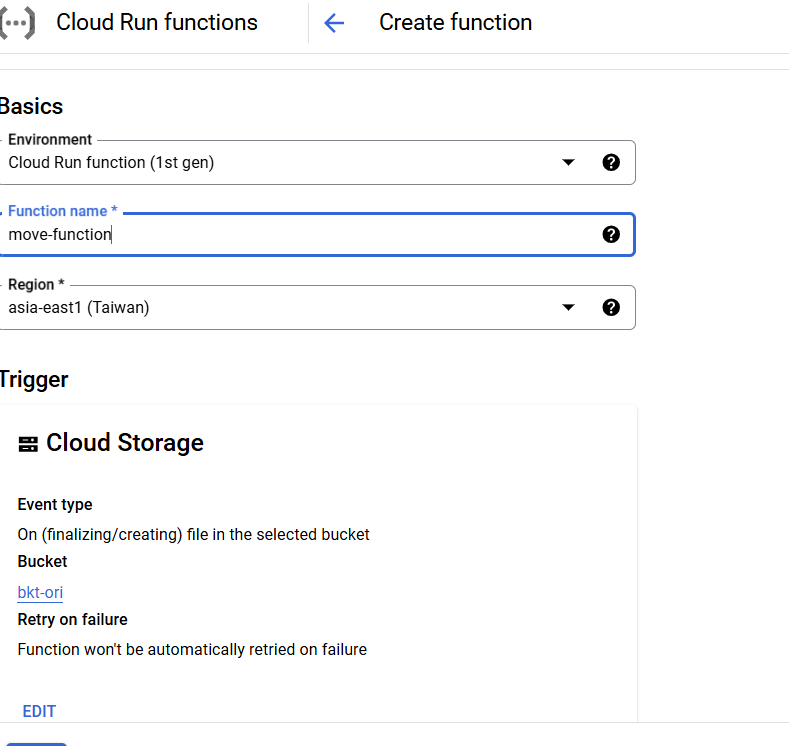
* CODE: main.py
```
import functions_framework
from google.cloud import storage
from google.cloud.storage import Blob


# Triggered by a change in a storage bucket
@functions_framework.cloud_event
def hello_gcs(cloud_event):

    data = cloud_event.data

    event_id = cloud_event["id"]
    event_type = cloud_event["type"]

    bucket = data["bucket"]
    name = data["name"]
    metageneration = data["metageneration"]
    timeCreated = data["timeCreated"]
    updated = data["updated"]
    
    print("="*30)
    print(f"Event ID: {event_id}")
    print(f"Event type: {event_type}")
    print(f"Bucket: {bucket}")
    print(f"File: {name}")
    print(f"Metageneration: {metageneration}")
    print(f"Created: {timeCreated}")
    print(f"Updated: {updated}")
    print(f"Processing file: {name}.")
    storage_client = storage.Client(project='mygcp-436602')
    source_bucket=storage_client.get_bucket('mybkt-src')
    destination_bucket=storage_client.get_bucket('mybkt-dst') 
    blobs=list(source_bucket.list_blobs(prefix=''))
    print(blobs)
    for blob in blobs:
        if blob.size > 1000000 and blob.name == name:
            source_blob = source_bucket.blob(blob.name)
            new_blob = source_bucket.copy_blob(source_blob, destination_bucket, blob.name) 
            blob.delete(if_generation_match=None)
            print(f'File moved from {source_blob} to {new_blob}')
        else:
            print("File size is below 1MB")
```
* requirements.py:
```
functions-framework==3.*
google-cloud-storage
google-cloud
```
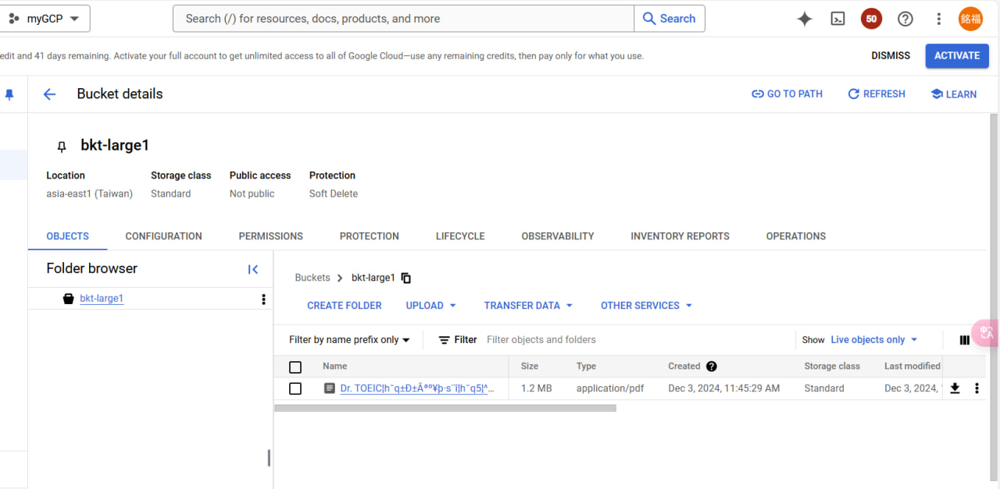
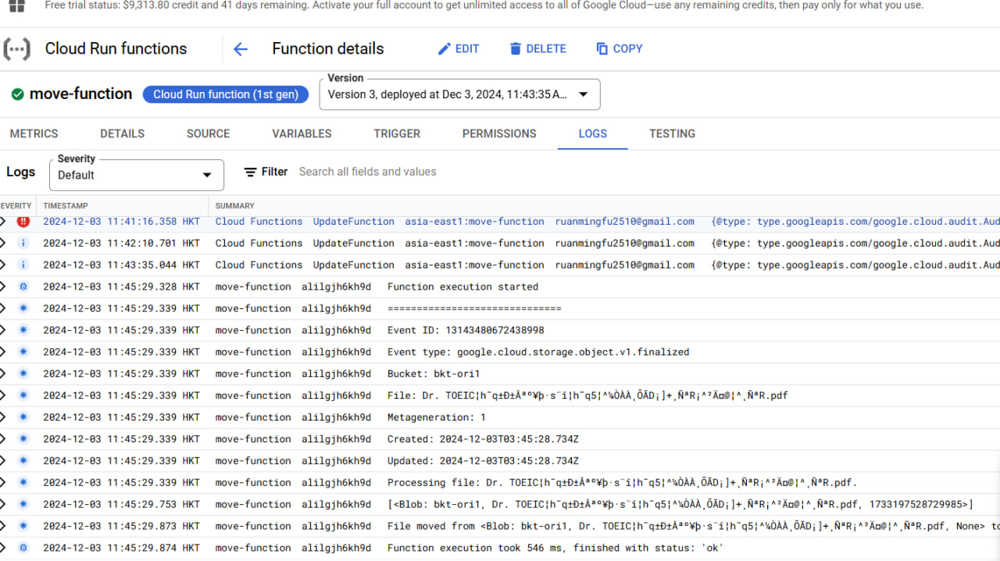

# 3. Connecting to Cloud SQL with Cloud Functions using CLI
https://sagadevan.medium.com/connecting-to-cloud-sql-with-cloud-functions-using-cli-c6bc1c47e5a7
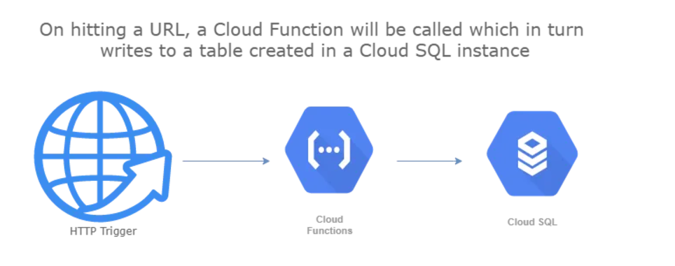
* Code:
```
gcloud sql instances create mydb --database-version=MYSQL_5_7 --cpu=2 --memory=4GB --root-password=admin1234 --assign-ip --zone=us-central1-a --availability-type=zonal --no-backup
```
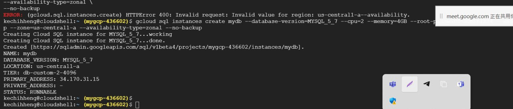
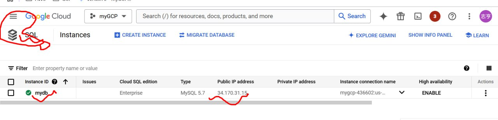

```
gcloud sql databases create demo-db --instance=mydb, -i mydb
```
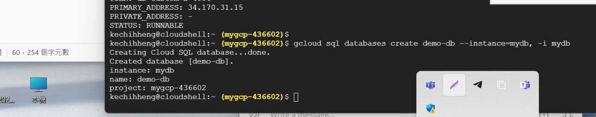

```
gcloud sql connect mydb --user=root
```
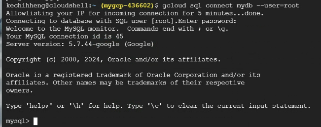