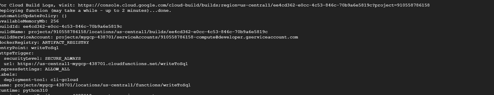
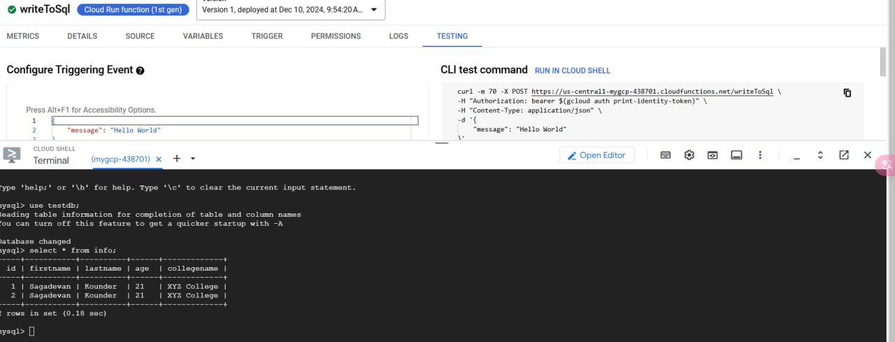
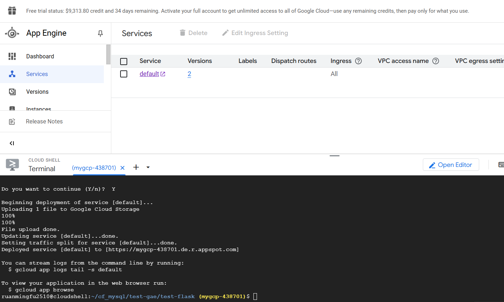
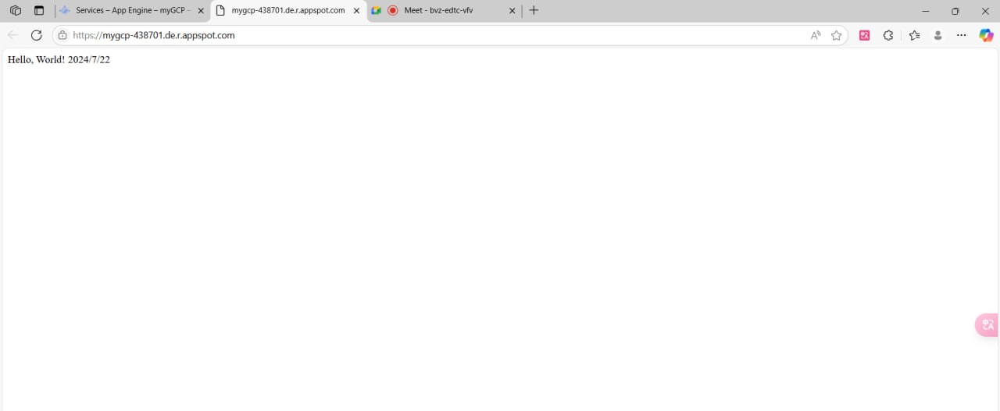
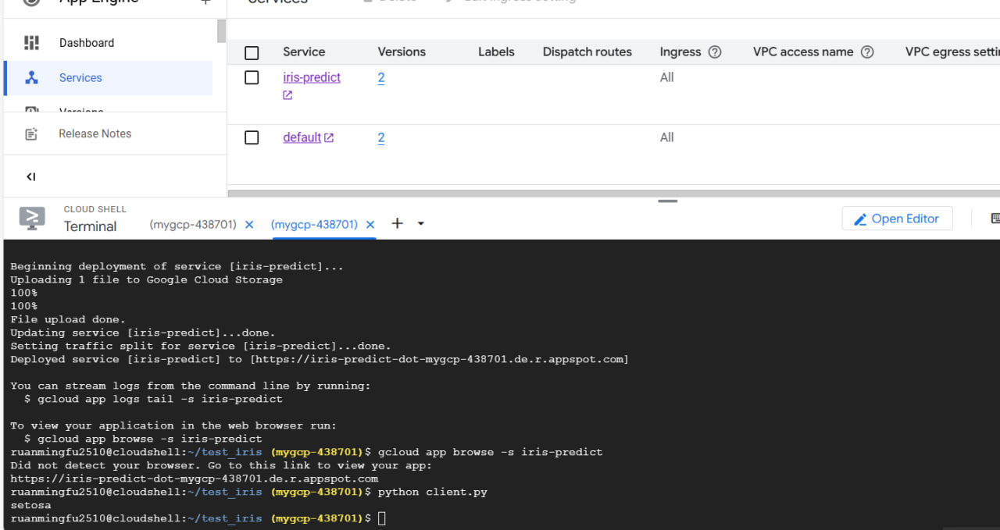

# CLOUD SQL:
https://sagadevan.medium.com/connecting-to-cloud-sql-with-cloud-functions-using-cli-c6bc1c47e5a7
* Continue of 120324.md
```
    1. Create cf_mysql folder
    2. Create main.py and requirements.text in cf_mysql
    3. Deploy
```
* main.py:
```
import sqlalchemy
#connection name we noted earlier
connection_name = "mygcp-438701:us-central1:mydb"
#database name
db_name = "testdb"
db_user = "root"
db_password = "admin1234"
driver_name = 'mysql+pymysql'
query_string = dict({"unix_socket": "/cloudsql/{}".format(connection_name)})

def writeToSql(request):
   #You can change this to match your personal details
   stmt = sqlalchemy.text("INSERT INTO info ( firstname, lastname, age, collegename) values ('Sagadevan', 'Kounder', '21', 'XYZ College')")

   db = sqlalchemy.create_engine(
   sqlalchemy.engine.url.URL(
   drivername=driver_name,
   username=db_user,
   password=db_password,
   database=db_name,
   query=query_string,
   ),
   pool_size=5,
   max_overflow=2,
   pool_timeout=30,
   pool_recycle=1800
   )
   try:
      with db.connect() as conn:
        conn.execute(stmt)
        print("Insert successful")
   except Exception as e:
      print ("Some exception occured" + e)
      return 'Error: {}'.format(str(e))
   return 'ok'
```
* requirements.txt
```
SQLAlchemy==1.3.12
PyMySQL==0.9.3
```
* NEXT STEP: (Deploy)
```
gcloud functions deploy writeToSql --entry-point writeToSql --runtime python310 --trigger-http --allow-unauthenticated  --no-gen2 --source .
```

* FINAL:


# APP ENGINE:
```
    1. Create folder test-gae
    2. Create folder test-flask in test-gae
    3. Create 3 files app.yaml main.py requirements.py
    4. Deploy
```
```
ruanmingfu2510@cloudshell:~/cf_mysql (mygcp-438701)$ mkdir test-gae
ruanmingfu2510@cloudshell:~/cf_mysql (mygcp-438701)$ cd test-gae
ruanmingfu2510@cloudshell:~/cf_mysql/test-gae (mygcp-438701)$ mkdir -p test-flask
ruanmingfu2510@cloudshell:~/cf_mysql/test-gae (mygcp-438701)$ cd test-flask
ruanmingfu2510@cloudshell:~/cf_mysql/test-gae/test-flask (mygcp-438701)$ ls
ruanmingfu2510@cloudshell:~/cf_mysql/test-gae/test-flask (mygcp-438701)$ touch app.yaml main.py requirements.txt
ruanmingfu2510@cloudshell:~/cf_mysql/test-gae/test-flask (mygcp-438701)$ ls
app.yaml  main.py  requirements.txt
ruanmingfu2510@cloudshell:~/cf_mysql/test-gae/test-flask (mygcp-438701)$ vim main.pt

[3]+  Stopped                 vim main.pt
ruanmingfu2510@cloudshell:~/cf_mysql/test-gae/test-flask (mygcp-438701)$ ls
app.yaml  main.py  requirements.txt
ruanmingfu2510@cloudshell:~/cf_mysql/test-gae/test-flask (mygcp-438701)$ vim main.py
ruanmingfu2510@cloudshell:~/cf_mysql/test-gae/test-flask (mygcp-438701)$ vim requirements.txt
ruanmingfu2510@cloudshell:~/cf_mysql/test-gae/test-flask (mygcp-438701)$ vim app.yaml
ruanmingfu2510@cloudshell:~/cf_mysql/test-gae/test-flask (mygcp-438701)$
```
* main.py:
```
from flask import Flask
app = Flask(__name__)

@app.route("/")
def hello():
    return "Hello, World! 2024/7/22"

if __name__ == "__main__":
    app.run(debug=True)
```
* requirements.txt:
```
flask
```
* app.yaml:
```
runtime: python39
service: default
```
* Next step: (Deploy)
```
gcloud app deploy
```




# Iris Model with APP ENGINE:
```
    1. Create folder test-iris
    2. Create 5 files app.yaml client.py main.py requirements.txt train_model.py
    3. In server, run ```python train_model.py``` and ```python main.py```
    4. In client, run ```python client.py```
    3. Deploy 
```
* train_model.py
```
# -*- coding: utf-8 -*-
import pickle
from sklearn import datasets
from sklearn.model_selection import train_test_split
from sklearn import tree

# simple demo for traing and saving model
iris=datasets.load_iris()
x=iris.data
y=iris.target

#labels for iris dataset
labels ={
  0: "setosa",
  1: "versicolor",
  2: "virginica"
}

x_train, x_test, y_train, y_test = train_test_split(x, y, test_size=.25)
classifier=tree.DecisionTreeClassifier()
classifier.fit(x_train,y_train)
predictions=classifier.predict(x_test)

#export the model
model_name = 'model.pkl'
print("finished training and dump the model as {0}".format(model_name))
pickle.dump(classifier, open(model_name,'wb'))
```
* requirements.txt
```
scikit-learn 
flask
```
* main.py
```
import pickle

from flask import Flask, request, jsonify

app = Flask(__name__)

# Load the model
model = pickle.load(open('model.pkl', 'rb'))
labels = {
  0: "versicolor",
  1: "setosa",
  2: "virginica"
}

@app.route("/", methods=["GET"])
def index():
    """Basic HTML response."""
    body = (
        "<html>"
        "<body style='padding: 10px;'>"
        "<h1>Welcome to my Flask API</h1>"
        "</body>"
        "</html>"
    )
    return body

@app.route('/api', methods=['POST'])
def predict():
    # Get the data from the POST request.
    data = request.get_json(force = True)
    predict = model.predict(data['feature'])
    return jsonify(predict[0].tolist())

if __name__ == '__main__':
    app.run(debug = True, host = '0.0.0.0', port=8080)
```
* client.py
```
# -*- coding: utf-8 -*-
import requests
# Change the value of experience that you want to test
url = 'https://iris-predict-dot-mygcp-436602.de.r.appspot.com/api'   # 改成 http://127.0.0.1:8080/api
feature = [[5.8, 4.0, 1.2, 0.2]]
labels ={
  0: "setosa",
  1: "versicolor",
  2: "virginica"
}

r = requests.post(url,json={'feature': feature})
print(labels[r.json()])
```

* app.yaml
```
runtime: python312
service: iris-predict
```
* Next step: deploy
```
gcloud app deploy
```
