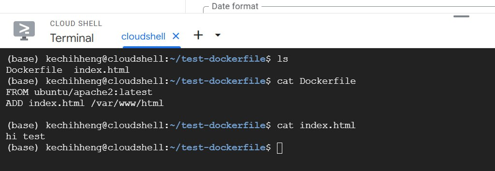
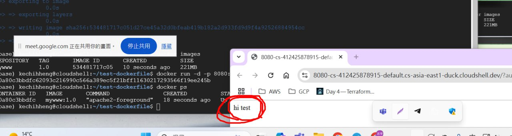
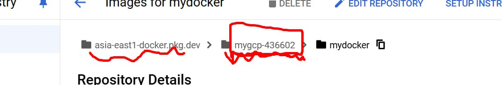
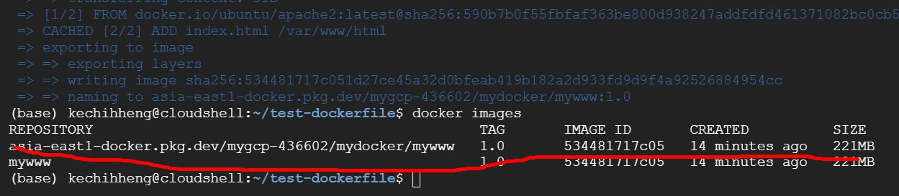
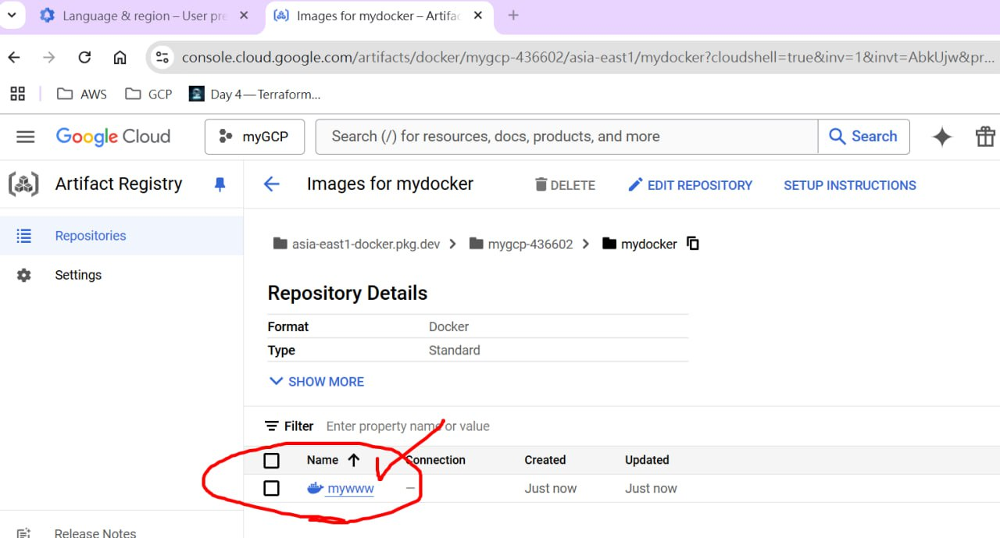
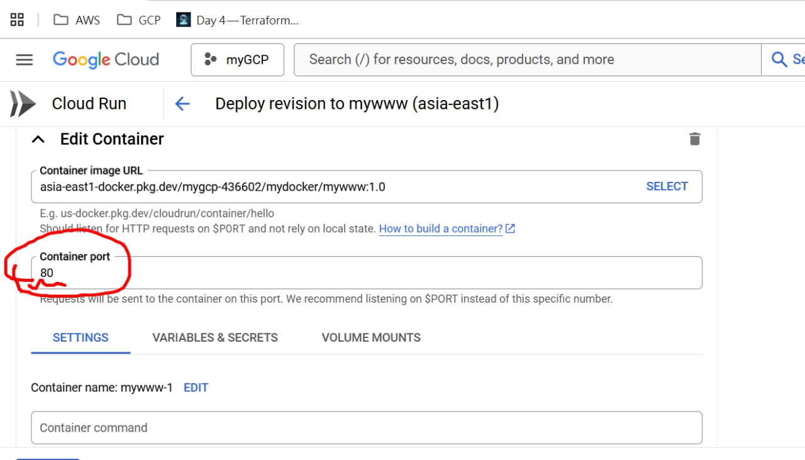
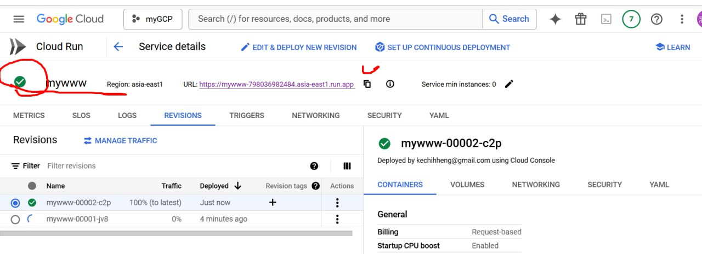
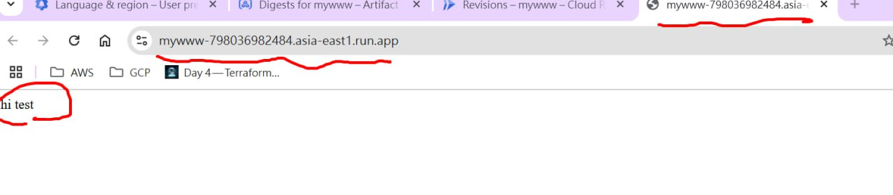
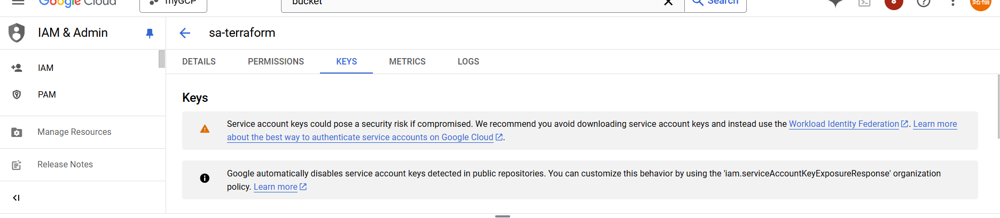
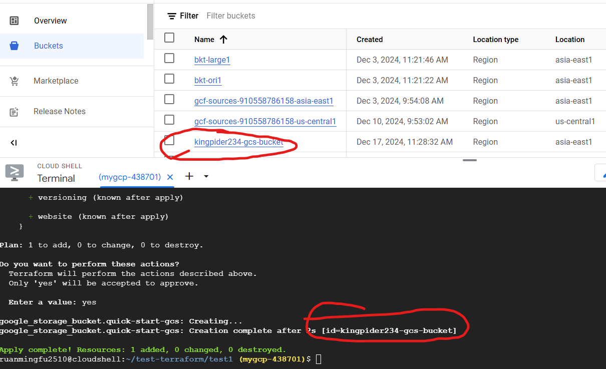

# DOCKER
```
    1. Create 2 files Dockerfile and index.html
    2. docker build -t mywww:1.0 .
    3. docker run -d -p 8080:80 mywww:1.0
    4. Web Preview
```




# ARTIFACT REGISTRY
```
    1. Create repository *mydocker
```

```
    2. docker build -t  asia-east1-docker.pkg.dev/mygcp-436602/mydocker/mywww:1.0 .
```

```
    3. docker push  asia-east1-docker.pkg.dev/mygcp-436602/mydocker/mywww:1.0
```

```
    4. Deploy
```






# TERRAFORM
https://devops-with-alex.com/day-4-terraform-install/

```
    terraform init
    terraform fmt
    terraform validate
    terraform plan
    terraform apply / terraform destroy
```
```
    1. ruanmingfu2510@cloudshell:~/test-terraform/test1 (mygcp-438701)$ ls
main.tf  mysa.json
```
*main.tf
```
provider "google" {
  credentials = "${file("mysa.json")}"
  project = "mygcp-438701"
  region  = "asia-east1"
}

resource "google_storage_bucket" "quick-start-gcs" {
  name          = "kingpider234-gcs-bucket"
  location      = "asia-east1"
  force_destroy = true
}
```
*mysa.json
```
Service account key
```

```
    Final step: terraform apply
```
