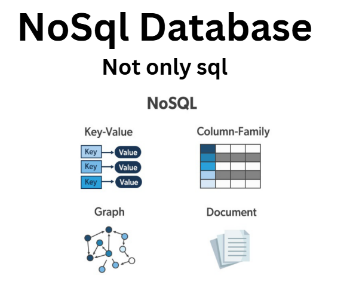
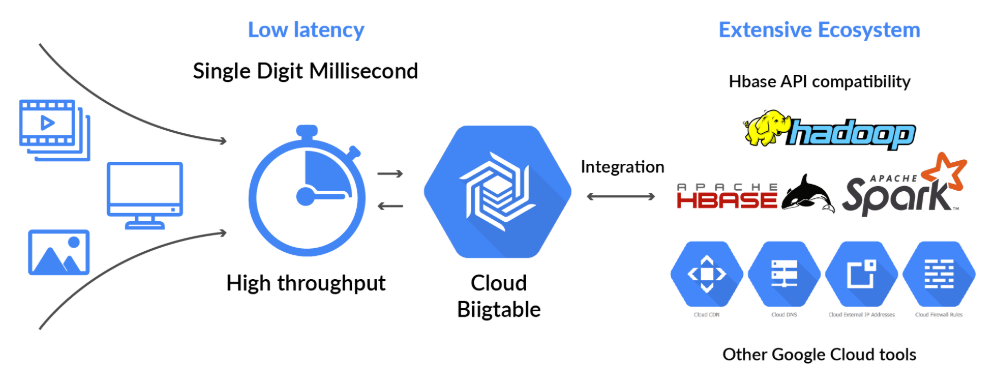
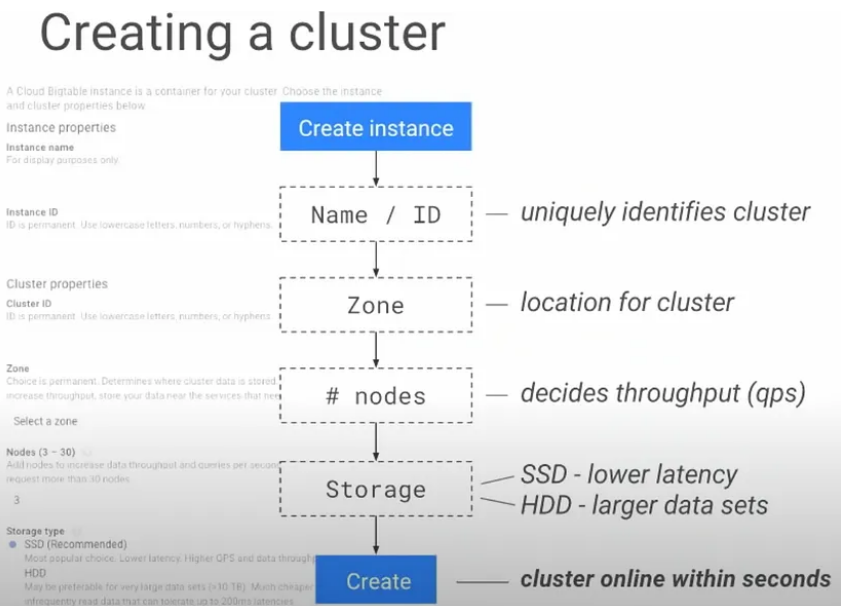
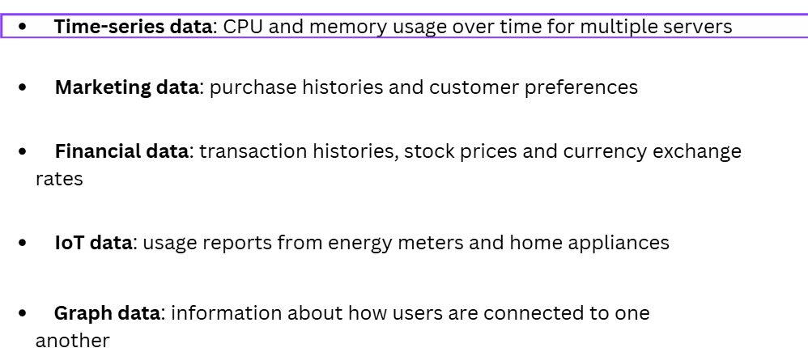
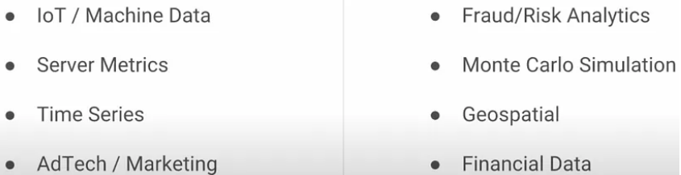
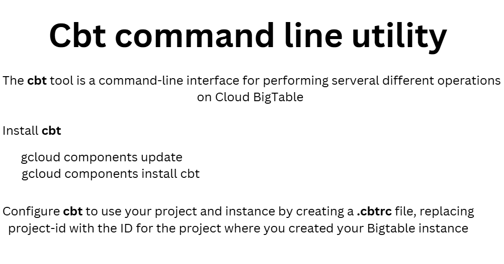
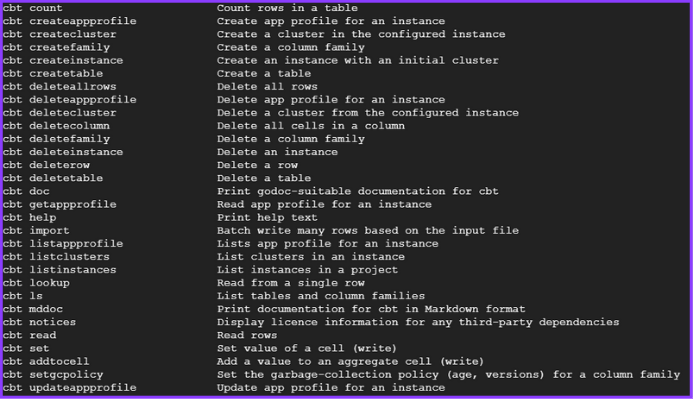

# CLOUD BigTable
https://www.canva.com/design/DAGZ0ORN5bI/nnvP0IFK21t2QM8yVcj9Iw/edit?ui=eyJEIjp7IlAiOnsiQiI6ZmFsc2V9fX0

## NoSql database
NoSQL databases usually fall under any one of these four categories:

- Key-value stores: is the most straightforward type where every item of your database gets stored in the form of an attribute name (i.e., "key") along with the value.

- Wide-column stores: accumulate data collectively as a column rather than rows which are optimized for querying big datasets.

- Document databases: couple every key with a composite data structure termed as a document. These documents hold a lot of different key-value pairs, as well as key-array pairs or sometimes nested documents.

- Graph databases: are used for storing information about networks, like social connections.



## Cloud Bigtable:

```
It’s another NoSQL kind of database and it’s a fully managed system inside the Google Cloud Platform. It’s a wide column, NoSQL database system.
```

```
BigTable is not a serverless service. That means, we need to create cluster for this server ourselves.
```
# Creating cluster
*
# Bigtable Use case


# cbt command line




